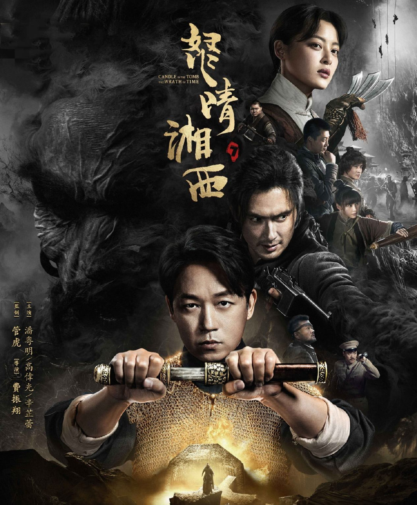

export { book as theme } from '@mdx-deck/themes'
import {
  Split,
} from '@mdx-deck/layouts'

# 小说与影视化改编

热烈庆祝贺乐的不知道什么会进入第二期🎉🎉🎉🎉

---

# 《鬼吹灯之怒晴湘西》

by 天下霸唱

---

半个多世纪之前，正值壮年的卸岭盗魁陈玉楼伙同军阀合盗湘西瓶山元将之墓。墓中机关重重，几次均未得手，死伤甚众。于是陈玉楼联络搬山道人，告知瓶山中有千年丹丸，四处寻找雮尘珠的鹧鸪哨为之心动，决定同卸岭众盗一同发掘瓶山……

---

<Split>

# 陈玉楼

</Split>

---

出身盗墓世家，三代盗魁，卸岭群盗的舵把子，精熟卸岭群盗历代传下来的器械手段，机变无双，眼力过人，能够“观泥痕、认草色、寻藏识宝”，在古墓地宫中能不点火把而看清周遭事物。

善于笼络人心，有口吐莲花的本事。扶植湘西军阀罗老歪，有过统一中国的野心。

重视自身名誉，痛恨任何失败。在盗发云南献王墓时，中了护陵的毒雾双目失明，从此以算命为生，漂泊各地。最后和胡八一他们去了美国。

---

<Split>

# 鹧鸪哨

</Split>

---

帅哥，本名不详，因擅长口技，绰号鹧鸪哨。

扎格拉玛部族的后裔。该族受精绝女王的诅咒，族人四十岁以后开始步入死亡。部分族人成为搬山道人，以寻找解除诅咒的雮尘珠。鹧鸪哨是最后一位搬山道人。

阅历极广，精通各地方言、风土人情，绿林中声名远扬。手持两把德国二十响镜面匣子，枪法如神，擒拿格斗无出其右。

曾在陈玉楼的保媒下与红姑娘定下亲事，但其后红姑娘感染瘟疫去世，鹧鸪哨也在倒斗中身负重伤，后带领族人移居美国，客死海外。外孙女是Shirley杨。

---

<Split>

# 网剧《怒晴湘西》

</Split>

---

## 熟读政策

- 不能成精
  - 片名没了鬼
  - 强行走近科学
- 主角是好人
  - 陈玉楼人设菜鸡
  - "盗墓"改成"寻宝"
  - 动机修改
  - 鹧鸪哨不打要害

---

## 平衡主角戏份

- 前期增加鹧鸪哨
- 后期增加陈玉楼: 成长线 or 抗日神剧？

---

## 增加角色互动/冲突

---

# 文字 vs 影视化

---

## 古狸碑

---

眼看陈瞎子神智一失，就会被狸子引去水边洗肠，可无巧不成书，也算陈瞎子命不该绝，古墓林中忽然一阵拨草折枝的响声，只听那边有人朗声念道：“天地有正气，杂然赋流形，下则为河岳，上则为日星，于人曰浩然，沛乎塞苍冥……”

---

这《正气歌》中每字每句，都充满了天地间的浩然正气，专能震慑奸邪。陈瞎子一听之下，立刻感到身上一松，知觉竟自恢复了几分，心下也清醒了，随即明白是有高人相助，自己这条命算是捡回来了，但不知是哪路英雄这般仗义，想开口去问，但身体麻痹过久，还是说不出话来。

骑着白驴的老媪也受到震慑，脸上一阵变色，贼眉鼠眼地环顾左右，她身边的那只小狸子，更是受惊不小，战战兢兢地藏在驴下，探头探脑地不住张望。

这时就见荒草一分，走出两男一女三个年轻苗人，看身上装饰都是是冰家苗打扮，各背了一个大竹篓，不知里面装了些什么。
……

---

谁知那三个苗人却并不理睬陈瞎子，口中念念有词，将那骑白驴的妖妇围在当中，对着她撑开花伞，原来伞上都嵌了许多专破圆光术的镜子。陈瞎子只觉得月下黑雾一闪，心中更加清醒了些，再看时，残碑前哪有什么白老太太。

只见一条全身灰白秃斑的老狸子，骑着好大一只白兔，那老狸子瘦得皮包骨头，身上的毛都快掉秃了，只剩下遍体灰白干瘦的老皮，但是两只眼睛极亮，贼溜溜的正盯着那三个苗人看。另有一只黄毛花斑的小狸子，在三柄镜伞合围之下，被逼得惊惶失措，只能在原地乱转，先前那种嚣张已极的神态，早就不知丢到哪里去了。

---

老狸子见来人不善，也知道大事不好，一催胯下的兔子，那只大兔子带着老狸先冲向冰家苗女子，不等触敌，蓦地一个转折，早已蹿回了残碑，又从断碑上高高跳起，想要声东击西，趁三个苗人措手不及，从其中一个苗人的头顶上跃过逃走。 ……

老兔子蹿跃之势虽快，想不到那苗人身手更快，就在兔子负了老狸从其中一个苗人头顶蹿过之际，那苗人忽地断喝一声，一个筋斗翻身而起，轻捷不让飞鸟，使个倒踢紫金冠踢到半空，这一脚恰似流星赶月，抡出去结结实实地迎头踢个正着。老狸和兔子顿时被踢得直飞出去，倒撞在半截残碑上，发出骨骼碎裂的闷响。

---

[EP02 17:00](https://v.qq.com/x/cover/79npj83isb0ylvq/n0029vw8pes.html)

---

## 怒晴鸡

- 怒晴鸡发威
- 鹧鸪哨秀口技

---

> 正这时，忽听一阵高亢的雄鸡鸣叫，却原来是那老者的儿子，正从鸡笼中擒了一只大公鸡出来，旁边摆了只放血的大碗和木墩子，一柄厚背的大菜刀放在地上，看样子是要准备宰杀那只雄鸡。 
>
> 只见那只大公鸡彩羽高冠、虽是被人擒住了、但仍旧威风凛凛、气宇轩昂，神态更是高傲不驯。它不怒自威，一股精神透出羽冠，直冲天日，与寻常鸡禽迥然不同。那鸡冠子又大又红，鸡头一动，鲜红的肉冠就跟着乱颤，简直就像是顶了一团燃烧的烈焰。大公鸡全身羽分为五彩，鸡喙和爪子尖锐锋利，在正午的日头底下，都泛着金光，体型比寻常的公鸡大出一倍开外。 

---

[EP09 24:26](https://v.qq.com/x/cover/79npj83isb0ylvq/w00298ixvb7.html)

---

## 斗尸王和白猿

- 2 v 2 的戏怎么拍

---

鹧鸪哨额头上满是冷汗，正没奈何处，见那全身是血的苍猿猛下杀手，转眼间就要举着石头砸下，再不动手阻拦，就只能眼睁睁看着红姑娘脑浆横飞，只好冒死行险，做个死中求活的搏浪一击。
闪念之间，鹧鸪哨心中已有了计较，当下里将胳膊肘撤开，身后僵尸黑洞洞的大口立即张开，直朝他后颈咬来。
鹧鸪哨趁着那僵尸从后上扑之力，翻身而起，背着那甩不脱的尸身着地一滚，就已到了红姑娘身边。
这时鹧鸪哨仰面向天，僵尸就在他背后张着阴气森森的大嘴，就在即将一口咬下的时候，鹧鸪哨猛一偏头，那举石砸落的苍猿，正好举着岩石砸将下来，斗大的岩石贴着鹧鸪哨的脸颊落下，恶狠狠砸在元代僵尸头上。

---

鹧鸪哨见那苍猿垂死之际，仍要行凶，不禁怒发冲冠，厉声喝道：“大胆！”双肘一撑身下的僵尸，就要起身结果了那苍猿的性命，谁知被他压在身下的僵尸脑袋虽然被岩石砸中，脑骨碎裂，脸部都凹了下去，可体内阴丹完好无损，岩石滚落在旁，僵尸口中随即又有一股阴气席卷而来……

那苍猿垂死之躯，此时全身鲜血都快从肚腹的伤口处流尽了，哪架得住鹧鸪哨钩扫连环，当即被卷到在地。

---

鹧鸪哨出手如风，一把揪住老猿脖颈将其扯到身前，倘若是换作平时，那苍猿必能挣扎一番，鹧鸪哨也未必能一举将它擒住，可重伤之余已是油尽灯枯，竟是丝毫反抗不得，恰被鹧鸪哨掼在地上，不偏不斜地恰好送到僵尸口边。

老猿连叫都没来得及叫上一声，就被元代古尸体内的阴丹吸住，周身上下残存的生气，不断被吸人僵尸口中，只听得“嗬嗬”几声哀鸣，一只苍髯白猿，全身长毛尽落，犹如一瞬间光阴飞逝，生命弹指老去。

---

这苍猿本就只剩下半条性命苟延残喘，被那阴丹一吸，全身血液仿佛都已经凝固干涸住了，顷刻间就化做了一副毫无生机的空皮囊，只是与那苗子一样尚未断气，四肢都不能动，空剩两颗眼珠子，毫无神采地在干瘪深陷如骷髅般的眼窝中乱转，脸上神情都已阴阳难辨，显得极是可怕。

鹧鸪哨趁苍猿被阴丹所吸的一瞬间，一个鲤鱼打挺从地上跃起，更无半分犹豫，立即揪住僵尸身后袍服，连同那苍猿一并从地上拽起。

---

此刻古尸仍然死缠住魂气未尽的老猿不放，鹧鸪哨施出克制僵尸的绝技魁星踢斗，身形晃动中，已绕到僵尸身后，双臂从它腋下穿过，反锁后颈，抬膝顶住大椎，如此一来，便是千年尸魔，在搬山秘术面前，也只有束手就擒的份了。

鹧鸪哨是出手不容情，容情不出手，先前三番五次都不得时机，反倒险送了命去，眼见现在正是机不可失，失不再来，当下手脚加劲，只听那元代僵尸体内筋骨缓缓撑裂，如同层层旧帛棉纸来回摩擦，整具古尸都被他从后反绞得仰起头来，前面那半死不活的老猿如遇大赦，顿时从僵尸口中松脱，软塌塌地瘫倒在地，至此方才咽下了最后一口气息，瞪目而亡。

---

那生前身为统兵大将的古尸，也当真了得，若换做别的，早被鹧鸪哨轻而易举地绞碎脊椎，可这具尸身内丹凝结不化，虽死如生，周身筋骨肌肉仍是紧密结实，体格又是粗壮高大，鹧鸪哨一绞之下，竟未听到骨骼碎裂折断之声，不由得发起狠来，手上扣紧颈骨，使出了十二分的力气。

猛听僵尸身上锁子连环甲“哗啦啦”一片抖动，骨骼摩擦断裂，古尸的首级连着十几节脊椎，硬生生被搬山道人鹧鸪哨从腔子里揪了出来，高大的无头躯体咕咚一声跪倒在地上，漆黑的血液混合着内脏，从脖腔里随着脊椎喷出，溅得遍地都是。

---

EP 20

---

## 萌萌哒陈玉楼

影视自创梗，呼应

---

陈瞎子还打算将来拿红姑娘做个筹码，让鹧鸪哨再为常胜山卖几次命，便又对鹧鸪哨说：“还有一事，咱家山头里的红姑娘托陈某做媒，为兄好事，就答应了她，拿她当做亲妹子一般。将来等你从黑水城回来，想必那红姑娘的腿伤也该痊愈了，不如就让她随了你去。她家遭灭门之祸，也是苦楚孤零的一个人，绿林里终究不是她安身立命的地方。” 

鹧鸪哨不拘细节，当即应道：“此去西夏黑水城，成败难料，但只要有命回来，必不负陈兄美意，愿带她远走高飞。” 

---

陈瞎子心中暗骂：“好你个修心不修口、戒色不戒淫的假道士，你倒答应得真痛快，也不推辞推辞……可红姑娘毕竟是在常胜山里插香的，将来她想拔香离山金盆洗手，只怕没这么容易，到时候看我怎么难为你的。” 

---

[EP05 03:59](https://v.qq.com/x/cover/79npj83isb0ylvq/b0029baolzs.html)

[EP21 ]()

---

## 悲剧的鹧鸪哨

怎么展现美强__惨__？

---

> 想不到这一眨眼的工夫，世上最后的三个搬山道人，就剩下鹧鸪哨自己一个了，他在一瞬间心中空落落地完全忘了身在何方。 

> 鹧鸪哨见自己师弟师妹的尸体，都被盗众抬出山外，心中悲苦难言。他们之间虽以师兄弟相称，实际上花灵和老洋人都是他一手带出来的，又都是同宗同族，更兼朝夕相处，实有骨肉血脉之情。但凭他一个人本事再大，胆略智术终究是有个限度，如今眼见师弟师妹命丧荒山。自己竟无力相救，奈何不得心热事冷，虽然亲手替他们报了仇，可心里仍然万分难过，更担心搬山分甲术从此失传。 
> 
> 不过眼下大事未定，只好强打精神……

---

> 鹧鸪哨满心热望，虽然心理上有所准备，仍然禁不住失落之极，似乎是三九天被当头淋了一盆冰水，从头到脚都寒透了，愣在当场，觉得嗓子眼一甜，哇的吐出一口鲜血，全喷在龟甲之上。了尘长老大惊，知道鹧鸪哨这个人心太热，事太繁，越是这样的人越是对事物格外执着，心情大起大落就容易呕血，担心鹧鸪哨会晕倒在地……
>
> 
——《鬼吹灯之龙岭迷窟》

---

[EP17 04:51](https://v.qq.com/x/cover/79npj83isb0ylvq/s0029srymce.html)

vs

[EP20 ]()

---

# No Country for Old Men

by Cormac McCarthy

---
# 角色
---

## 牛仔/老兵 Moss

---

## 杀手

---

## 老警察

---

剧情

---

同名电影

- 奖项

---

减法

---

# 文本 vs 影视化

---

# Moss 和 Chigur 对峙

---

## Chigur 的硬币

---

## 老警察的独白

---

# ❤️❤️❤️❤️❤️🎉🎉🎉🎉🎉
