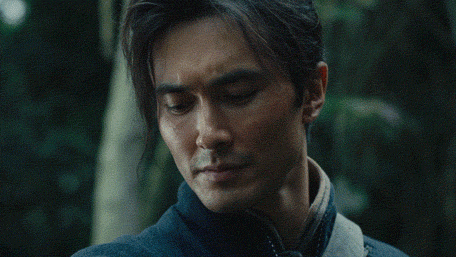

export { book as theme } from '@mdx-deck/themes'
import {
  Split,
} from '@mdx-deck/layouts'

# 《鬼吹灯之怒晴湘西》

by 天下霸唱

热烈庆祝贺乐的不知道什么会进入第二期🎉🎉🎉🎉

---

# 鬼吹灯系列的四大门派

- 摸金
- 发丘
- 搬山
- 卸岭

> 发丘有印，摸金有符，搬山有术，卸岭有甲

---

## 摸金校尉

- 寻龙诀，天星风水秘术
- 分金定穴
- 代表：了尘、胡八一、雪莉杨、王胖子

---

## 发丘天官

和摸金校尉本是一回事，发丘印毁了以后便只有摸金校尉

---

# 搬山道人

- 西域的扎格拉玛族受精绝女王的诅咒，族人四十岁以后血液开始变黄，完全变黄后会血液凝固而死。部分族人成为搬山道人，四处寻找解除诅咒的雮尘珠。
- 天地间的万事万物，有一强，则必有一制，强弱生克相制，即为搬山之术。
- 分山掘子甲
- 搬山填海术（《鬼吹灯只巫峡棺山》）
- 魁星踢斗
- 代表：鹧鸪哨

---

# 卸岭力士

- 卸岭其辈或散布天下，或啸聚山林，拜关帝，并尊西楚霸王为祖师，逢有古墓巨冢，便蜂拥而起，众力发掘，毁尸平丘，搜刮宝货，毫厘不剩，专效仿昔时“赤眉”义军的作为。
- 蜈蚣挂山梯
- 代表：陈玉楼

---

## 神秘组织：观山太保

- 邪术
- 孙教授(《鬼吹灯之巫峡棺山》)

---

半个多世纪之前，正值壮年的卸岭盗魁陈玉楼伙同军阀合盗湘西瓶山元将之墓。墓中机关重重，几次均未得手，死伤甚众。于是陈玉楼联络搬山道人，告知瓶山中有千年丹丸，四处寻找雮尘珠的鹧鸪哨为之心动，决定同卸岭众盗一同发掘瓶山……

---

<Split>

# 鹧鸪哨

</Split>

---

## 异域帅哥

鹧鸪哨活脱就是个年轻俊朗的木匠……

——红姑娘

外孙女雪莉杨鼻子高

---

## 有cp线

> 眼见他机变百出，举止洒脱，言辞清爽，绝不似常胜山里上至陈罗，下至无数盗伙那般要么粗俗无礼，要么便是一肚子称王称霸的野心，也只有嫁了他这等人物才不枉此一生，不禁有些后悔当年发誓终身不嫁，正是“夜来楼头望明月，只有嫦娥不嫁人”

---

---

## 枪法准

手持两把德国二十响镜面匣子，枪法如神

> 杀一个是杀，杀一百个也是杀，眼中精光一闪，瞅冷子在椁盖后举起镜面匣子，接连扣动扳机，子弹脱膛击射之声划破夜空，每一声枪响，便有一只猴子从树上倒栽下来。他是百步之外能打灭香火的准头，真叫弹无虚发，每只猴子都是眉心中弹，还不等从半空里掉在地上，就已被子弹贯脑而亡。

---

## 擒拿格斗无出其右

- 倒踢紫金冠
- 魁星踢斗

---

## 口技

“鹧鸪哨”

---

## 阅历极广，精通各地方言、风土人情

---

> 千年易过，古咒难消。搬山道人世世代代盗墓，也不知为此断送上了多少性命，始终连那珠影都没见着分毫，反倒是人丁凋零，可能不出百年就会断绝香火。鹧鸪哨发过大愿，拼上粉身碎骨也要将此物寻到手中

> 鹧鸪哨二目几欲喷出血来，恨不得肋生双翅，立即飞到西夏黑水城，去挖出那座埋在沙漠里的古刹。想来信奉唯一全知全能真神的扎格拉玛祖先显灵了，这千年之中断断续续的线索，终是在自己眼前有了眉目。

---

## 惨

- 师兄师妹惨死瓶山，成独苗
- 与了尘，托马斯夜盗黑水城通天大佛寺无所得，了尘死，鹧鸪哨断臂求生
- 未婚妻病逝，基友失踪
- 客死他乡,壮志未酬

---

<Split>

# 陈玉楼 / 陈瞎子

</Split>

---

## 富N代 + 黑社会?

> 陈家人脉最广，黑白两道都吃得开，湘黔之间往来贩运的烟土、军火交易，全被垄断在他手中，所以三湘四水的各路军阀土匪，不论势力大小都要依附于他，俨然就是当地的一个土皇上。

---

## 野心家

> 但在盗墓者的眼中，如此时局之下，国家的法律已形同虚设，正是盗掘古冢窃取秘器的大好时机。有经验的盗墓老手，当然不会放过这种机会。等到有朝一日政局稳定下来之后，古董价格必会看涨，介时再把所盗之物出手，便可轻轻松松地发上一笔横财。

---

> 陈瞎子听了这些旧事，他野心勃勃，不禁神驰想象：自己带着大群盗贼，深入狂沙大漠，挖出了精绝古城中堆积如山的金银财宝，回到湘阴做些惊天动地的大勾当，给绿林道做出些争气的举动出来，将来姓陈的说不定就是开国太祖了，也让那屡屡犯我中华上邦的美英倭夷，挨着个给我天朝“写降书、纳顺表，年年进贡，岁岁来朝”，如此方随心意，不负大丈夫平生之志，管教那几行青史之上，留下一笔“卸岭”之名。

---

## 口吐莲花

> 现今世道衰微，正是英雄好汉建功立业之秋。吾辈卸岭响马十万之众，自汉代赤眉兵败之后，分散四方，啸聚山林，如此潜隐山岳、寄踪江湖已久，虽只做些倒斗取利、分赃聚义的勾当，却也常有大图谋在内。纵观天下局势，已是四海动荡，人心思变，吾辈岂能不动一念？识时务者可称俊杰，知世道者当为英雄，值此良机，我等英雄合志，豪杰同心，必能图个腰金衣紫，青史留名，也不枉人生一世、草木一秋。

---

## 技能

- 小神锋
- 揽燕尾
- 观泥痕辨草色
- 闻山辨龙

---

## 夜眼

---

## 爱面子

- 笑点max
- 悲剧导火索
---

> 陈瞎子不紧不慢地从岭下走了回来，口中高声念着：“天地有正气，杂然赋流行，下则为河岳，上则为日星……”举止潇洒从容，好一派出尘之态，众人见了大为心折，暗赞总把头真是出口成章，急忙前去相迎。

> 陈瞎子专往自己脸上贴金，添油加醋地说了一遍他是如何如何追踪瘸猫，误入了一片古墓林，那古狸碑中有老狸子使幻术害人，他就顺手将之除了，回来的时候又遇到一伙搬山道人，受他们苦苦相邀，才共商盗墓大计直到玉兔西坠，这就耽搁了时辰。说完将那老狸子的尸体连同女尸的耳朵，一并扔在地上，让罗老歪等人观看。

---

> 罗老歪、花蚂拐等人惊叹不已，连赞陈瞎子手段高强，这成了精的老狸是何等奸猾，也被卸岭盗魁一脚踢了个骨断筋折。陈瞎子心中暗自得意，表面上装得轻描淡写毫不在乎

---

> 陈瞎子自恃手里有幅人皮地图，又生性狂妄自大，也懒得去找什么摸金校尉相助，回湘阴整顿停当了，便带着先前选出的一众手下出发。不料这一去就栽了大跟头，同去的手下兄弟全撂在了云南遮龙山，他自己也废了一双招子，侥幸活了下来。

> 陈瞎子成了废人，种种图谋野心，顿时烟消云散，自觉没面目再回去见人，隐姓埋名流落各地，一藏就是几十年。常胜山里的人都以为他死在云南了，卸岭盗众群龙无首，没过几年，内部便四分五裂，就此彻底土崩瓦解了。

---

# 广电爸爸

- 陈玉楼人设成菜鸡
- "盗墓"改成"寻宝"
- 盗墓动机修改

---

<Split>

# 网剧《怒晴湘西》

</Split>

---

# 文字 vs 影视化

---

> The truth is, for me, its obvious that 70 to 80 percent of a movie is sound.
>
> -- Danny Boyle

---

## 古狸碑

---

见有个瘦得皮包骨头的老媪，满身凶服，骑着一头雪白雪白的小毛驴，一脸不阴不阳的表情，就在断碑后站定了死死盯着陈瞎子看。

那瘦老太婆双眼精光四射，可她实在是太瘦了，就像是从墓里爬出来的干尸，可能除了皮就是骨头，看不出她身上有一丁点儿的肉来，皮肤都跟老树皮似的粗糙干瘪，半点血色儿也没有。而且身材奇短，站起来尚且不足三尺，脑袋上戴着顶白疙瘩小帽，一双穿着白鞋的小脚还是三寸金莲，嘴里边咬着半截猫肚肠子，正自鼓了个腮，“嘎吱嘎吱”的嚼得带劲

---

眼看陈瞎子神智一失，就会被狸子引去水边洗肠，可无巧不成书，也算陈瞎子命不该绝，古墓林中忽然一阵拨草折枝的响声，只听那边有人朗声念道：“天地有正气，杂然赋流形，下则为河岳，上则为日星，于人曰浩然，沛乎塞苍冥……”

这《正气歌》中每字每句，都充满了天地间的浩然正气，专能震慑奸邪。陈瞎子一听之下，立刻感到身上一松，知觉竟自恢复了几分，心下也清醒了……

---

> 只见一条全身灰白秃斑的老狸子，骑着好大一只白兔，那老狸子瘦得皮包骨头，身上的毛都快掉秃了，只剩下遍体灰白干瘦的老皮，但是两只眼睛极亮，贼溜溜的正盯着那三个苗人看。另有一只黄毛花斑的小狸子，在三柄镜伞合围之下，被逼得惊惶失措，只能在原地乱转，先前那种嚣张已极的神态，早就不知丢到哪里去了。

---

老兔子蹿跃之势虽快，想不到那苗人身手更快，就在兔子负了老狸从其中一个苗人头顶蹿过之际，那苗人忽地断喝一声，一个筋斗翻身而起，轻捷不让飞鸟，使个倒踢紫金冠踢到半空，这一脚恰似流星赶月，抡出去结结实实地迎头踢个正着。老狸和兔子顿时被踢得直飞出去，倒撞在半截残碑上，发出骨骼碎裂的闷响。

---

[EP02 10:44](https://v.qq.com/x/cover/79npj83isb0ylvq/n0029vw8pes.html)

- 秀夜眼
- 正气歌
- 倒踢紫金冠
- 音效
- 打光

爱面子的陈玉楼 EP02 24:05

---

## 神臂床子弩

---

EP07 21:32

---

## 怒晴鸡

---

> 正这时，忽听一阵高亢的雄鸡鸣叫，却原来是那老者的儿子，正从鸡笼中擒了一只大公鸡出来，旁边摆了只放血的大碗和木墩子，一柄厚背的大菜刀放在地上，看样子是要准备宰杀那只雄鸡。 
>
> 只见那只大公鸡彩羽高冠、虽是被人擒住了、但仍旧威风凛凛、气宇轩昂，神态更是高傲不驯。它不怒自威，一股精神透出羽冠，直冲天日，与寻常鸡禽迥然不同。那鸡冠子又大又红，鸡头一动，鲜红的肉冠就跟着乱颤，简直就像是顶了一团燃烧的烈焰。大公鸡全身羽分为五彩，鸡喙和爪子尖锐锋利，在正午的日头底下，都泛着金光，体型比寻常的公鸡大出一倍开外。 

---

[EP09 25:28](https://v.qq.com/x/cover/79npj83isb0ylvq/w00298ixvb7.html)

- 怒晴鸡发威
- 鹧鸪哨秀口技

---

## 斗蜈蚣

---

EP15 02:12

10:59

16:27

18:53

- 杀蜈蚣前的镜头推移
- 广角镜头拍摄导致的画面变形

---

## 斗尸王和白猿

---

鹧鸪哨见那苍猿垂死之际，仍要行凶，不禁怒发冲冠，厉声喝道：“大胆！”双肘一撑身下的僵尸，就要起身结果了那苍猿的性命，谁知被他压在身下的僵尸脑袋虽然被岩石砸中，脑骨碎裂，脸部都凹了下去，可体内阴丹完好无损，岩石滚落在旁，僵尸口中随即又有一股阴气席卷而来……

---

老猿连叫都没来得及叫上一声，就被元代古尸体内的阴丹吸住，周身上下残存的生气，不断被吸人僵尸口中，只听得“嗬嗬”几声哀鸣，一只苍髯白猿，全身长毛尽落，犹如一瞬间光阴飞逝，生命弹指老去。

这苍猿本就只剩下半条性命苟延残喘，被那阴丹一吸，全身血液仿佛都已经凝固干涸住了，顷刻间就化做了一副毫无生机的空皮囊，只是与那苗子一样尚未断气，四肢都不能动，空剩两颗眼珠子，毫无神采地在干瘪深陷如骷髅般的眼窝中乱转，脸上神情都已阴阳难辨，显得极是可怕。

---

那生前身为统兵大将的古尸，也当真了得，若换做别的，早被鹧鸪哨轻而易举地绞碎脊椎，可这具尸身内丹凝结不化，虽死如生，周身筋骨肌肉仍是紧密结实，体格又是粗壮高大，鹧鸪哨一绞之下，竟未听到骨骼碎裂折断之声，不由得发起狠来，手上扣紧颈骨，使出了十二分的力气。

猛听僵尸身上锁子连环甲“哗啦啦”一片抖动，骨骼摩擦断裂，古尸的首级连着十几节脊椎，硬生生被搬山道人鹧鸪哨从腔子里揪了出来，高大的无头躯体咕咚一声跪倒在地上，漆黑的血液混合着内脏，从脖腔里随着脊椎喷出，溅得遍地都是。

---

EP 20 14:29 

- 红姑娘秀飞刀
- 第一次施展魁星踢斗，失败

EP 20 18:24

- 2 v 2 怎么拍

28:52

- 再次施展魁星踢斗, KO

---

## 萌萌哒陈玉楼

---

陈瞎子还打算将来拿红姑娘做个筹码，让鹧鸪哨再为常胜山卖几次命，便又对鹧鸪哨说：“还有一事，咱家山头里的红姑娘托陈某做媒，为兄好事，就答应了她，拿她当做亲妹子一般。将来等你从黑水城回来，想必那红姑娘的腿伤也该痊愈了，不如就让她随了你去。她家遭灭门之祸，也是苦楚孤零的一个人，绿林里终究不是她安身立命的地方。” 

鹧鸪哨不拘细节，当即应道：“此去西夏黑水城，成败难料，但只要有命回来，必不负陈兄美意，愿带她远走高飞。” 

---

陈瞎子心中暗骂：“好你个修心不修口、戒色不戒淫的假道士，你倒答应得真痛快，也不推辞推辞……可红姑娘毕竟是在常胜山里插香的，将来她想拔香离山金盆洗手，只怕没这么容易，到时候看我怎么难为你的。” 

---

影视自创梗，呼应

[EP05 03:59](https://v.qq.com/x/cover/79npj83isb0ylvq/b0029baolzs.html)

EP21 20:02

---

## 悲剧的鹧鸪哨

怎么展现美强__惨__？

---

> 想不到这一眨眼的工夫，世上最后的三个搬山道人，就剩下鹧鸪哨自己一个了，他在一瞬间心中空落落地完全忘了身在何方。 

> ……心中悲苦难言。他们之间虽以师兄弟相称，实际上花灵和老洋人都是他一手带出来的，又都是同宗同族，更兼朝夕相处，实有骨肉血脉之情。但凭他一个人本事再大，胆略智术终究是有个限度，如今眼见师弟师妹命丧荒山。自己竟无力相救，奈何不得心热事冷，虽然亲手替他们报了仇，可心里仍然万分难过，更担心搬山分甲术从此失传。 
> 
> 不过眼下大事未定，只好强打精神……

---

[EP17 04:51](https://v.qq.com/x/cover/79npj83isb0ylvq/s0029srymce.html)

---

> 鹧鸪哨满心热望，虽然心理上有所准备，仍然禁不住失落之极，似乎是三九天被当头淋了一盆冰水，从头到脚都寒透了，愣在当场，觉得嗓子眼一甜，哇的吐出一口鲜血，全喷在龟甲之上。了尘长老大惊，知道鹧鸪哨这个人心太热，事太繁，越是这样的人越是对事物格外执着，心情大起大落就容易呕血，担心鹧鸪哨会晕倒在地……
>
> 
——《鬼吹灯之龙岭迷窟》

---

EP20 25:27

---

# ❤️❤️❤️❤️❤️🎉🎉🎉🎉🎉

